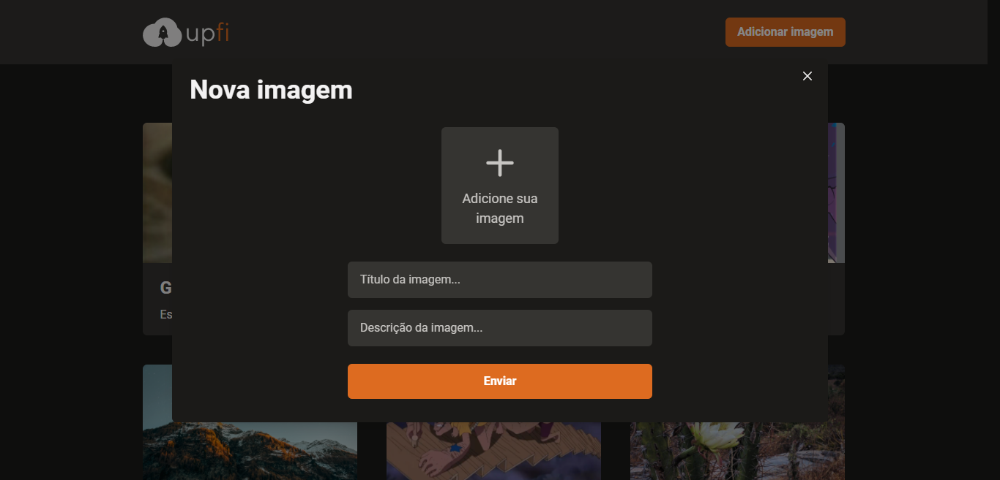

<div align="center">
  
</div>

<h3 align="center">
  Upload de imagens
</h3>

---




## 📄 Sobre

A aplicação é o desafio do Chapter IV da trilha React do Ignite.

O desafio consiste em implementar a validação das imagens com o *React Hook Form* e Mutations e Infinte Queries utilizando o *React Query*.

## 🧪 Tecnologias

- [ReactJS](https://reactjs.org/)
- [TypeScript](https://www.typescriptlang.org/)
- [Next.js](https://nextjs.org/)
- [React Query](https://react-query.tanstack.com/)
- [React Hook Form](https://react-hook-form.com/)
- [Fauna](https://fauna.com/)
- [Chakra UI](https://chakra-ui.com/)
- [ImgBB](https://pt-br.imgbb.com/)

## 💻 Iniciando

Para iniciar é necessário:
- [Node.JS](https://nodejs.org/en/)
- [NPM](https://www.npmjs.com/) ou [Yarn](https://yarnpkg.com/)
- Criar um banco de dados e uma colection chamada images no Fauna
- Adicionar a API Key do Fauna e do ImgBB em um arquivo `.env.local`, exemplificado no `.env.example`

```bash
  # Instalar as dependências
  $ yarn
  
  # Iniciar a aplicação
  $ yarn dev
  
  # Navegar para `http://localhost:3000`
```
